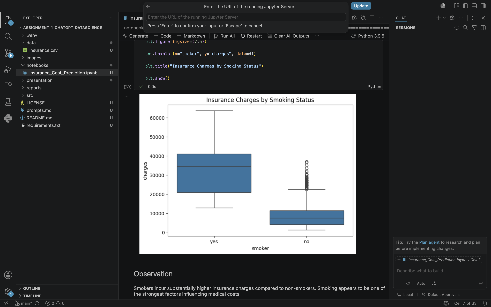
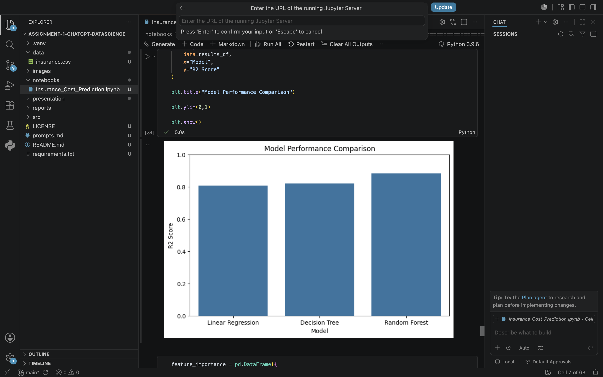

# 🏥 Medical Insurance Cost Prediction using Machine Learning


## 📌 Project Overview

This project presents an end-to-end data science workflow for predicting medical insurance costs using the Medical Cost Personal Dataset from Kaggle.

The project demonstrates every stage of a typical machine learning pipeline, including:

- Data loading
- Data cleaning
- Exploratory Data Analysis (EDA)
- Feature Engineering
- Data Preprocessing
- Model Training
- Model Evaluation
- Feature Importance Analysis

This project was completed with the assistance of ChatGPT as part of a chatbot-assisted coding assignment.

---

## 📂 Dataset

**Dataset:** Medical Cost Personal Dataset

Source:
https://www.kaggle.com/datasets/mirichoi0218/insurance

Dataset contains:

- 1,338 records
- 7 features

Features:

- Age
- Gender
- BMI
- Children
- Smoker
- Region
- Insurance Charges (Target Variable)

---

## 🎯 Objectives

The primary objectives of this project are:

- Understand the dataset
- Perform exploratory data analysis
- Build multiple regression models
- Compare model performance
- Identify the most influential features affecting insurance costs

---

## 🛠 Technologies Used

- Python
- Pandas
- NumPy
- Matplotlib
- Seaborn
- Scikit-learn
- Jupyter Notebook
- VS Code
- ChatGPT

---

## 📊 Exploratory Data Analysis

The following analyses were performed:

- Age Distribution
- BMI Distribution
- Insurance Charges Distribution
- Gender Distribution
- Smoking Status
- Region Distribution
- Number of Children
- Charges by Gender
- Charges by Smoking Status
- Charges by Region
- Age vs Charges
- BMI vs Charges
- Correlation Heatmap

---

## 📷 Project Screenshots

### Dataset Preview


---

### Correlation Heatmap


---

### Charges by Smoking Status



---

### Model Comparison



---

### Feature Importance


## 🤖 Machine Learning Models

The following regression models were trained:

- Linear Regression
- Decision Tree Regressor
- Random Forest Regressor

---

## 📈 Model Evaluation Metrics

Models were evaluated using:

- R² Score
- Mean Absolute Error (MAE)
- Root Mean Squared Error (RMSE)

---

## ⭐ Key Findings

- Smoking status was the strongest predictor of insurance charges.
- Age and BMI also had a significant impact.
- Random Forest achieved the best predictive performance.
- Data visualization helped uncover important trends before model development.

---

## 📁 Project Structure

```
Assignment-1-ChatGPT-DataScience/
│
├── data/
│   └── insurance.csv
│
├── notebooks/
│   └── Insurance_Cost_Prediction.ipynb
│
├── images/
│
├── reports/
│
├── presentation/
│   └── youtube_script.md
│
├── prompts.md
├── README.md
├── requirements.txt
└── LICENSE
```

---

## ▶️ How to Run

Clone the repository

```bash
git clone https://github.com/YOUR_USERNAME/Assignment-1-ChatGPT-DataScience.git
```

Navigate into the project

```bash
cd Assignment-1-ChatGPT-DataScience
```

Create a virtual environment

```bash
python -m venv .venv
```

Activate the environment

macOS/Linux

```bash
source .venv/bin/activate
```

Install dependencies

```bash
pip install -r requirements.txt
```

Launch Jupyter Notebook

```bash
jupyter notebook
```

---

## 🤖 AI Assistance

ChatGPT assisted with:

- Project planning
- Python code generation
- Debugging
- Exploratory Data Analysis
- Visualization ideas
- Machine Learning implementation
- Documentation
- Markdown formatting

All generated code was reviewed, tested, and modified before inclusion in the final project.

---

## 🎥 YouTube Demonstration

Video Link:

**(Add your YouTube link here after uploading the video.)**

---

## 👨‍💻 Author

Pranith Varma

MS Computer Software Engineering
San Jose State University

